import { LinkCard } from '@astrojs/starlight/components';
import { Steps } from '@astrojs/starlight/components';

<LinkCard title="There's a tutorial where we make a custom modifier! Start there" href="/getting-started/world/" />

Typically, **modifiers are where you'll write a majority of your gameplay code**.
Naturally, that means you need to be able to add modifiers of your own to the mix.

These modifiers become available in the editor, and can be used from code to
combine and create complex behaviours in a modular way.

The built in luxe modifiers are defined in the same way yours are!

## What does a modifier do?

We've [mentioned](/getting-started/luxe-101/) a modifier gives an entity meaning through the system that implements it, but what does that mean exactly? 

We can think of a modifier as 3 main parts:
- The **data** it stores for each entity
    - e.g Sprite color
- The **API** the user speaks to, to interact with the system
    - e.g Sprite.set_color(entity, color)
- The **implementation** of the system
    - applying color to that entity via a geometry that it owns


## How to define a modifier?

:::tip[Defining a modifier]{icon="puzzle"}
In luxe, a modifier is defined in code.
:::

As an example, we'll make a modifier that acts as a clock that adds up time. 
When you attach this to an entity, the entity will know how long it has been attached.
If we attach it right when the entity is created, we can use it to tell how long the entity has been in the world.

We'll make an empty file called `system/clock.modifier.wren`. 
A convention is to put systems in the `system/` folder as we saw before with `luxe: system/transform.modifier`. 
The `.modifier.wren` part isn't optional, this is the how the luxe asset pipeline knows that we want to treat this particular script as a modifier. 
This handles everything from there.


:::note
Currently there's a `*.modifier.api.wren` generated for your system alongside it, this 
is a temporary generated file and won't stay long term (it will live inside the .luxe/ folder).
:::


Run the build to generate the contents, and then edit it (see the [tutorial](/getting-started/world/)).

--- 

<Steps>

1. #### Defining per entity modifier data

    Inside the file, we'll start by defining our data. 
    There's a concept in luxe called blocks that we'll cover in detail in a near future tech post, but in short, it's a schema based data definition. 

    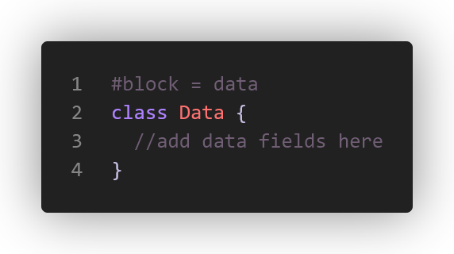
    
    It uses a Wren class to define the fields of the data block, and has concrete types and rules that are a 
    little special but power a ton of things. In this example we just need a single variable for time, so at 
    the top of our modifier we have this simple definition: 

    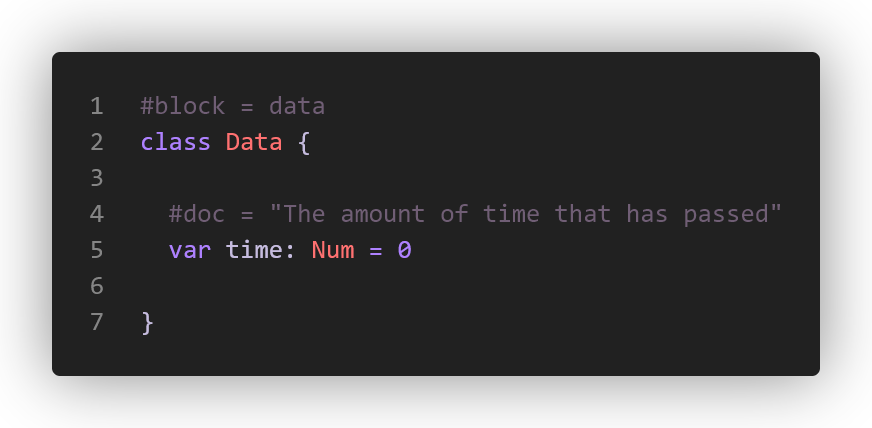

    There we go! Piece one is out of the way. 

2. #### The user facing API

    Now let's say we want to make it possible to reset the clock from the game code elsewhere - 
    if you've followed along, you'll notice the convention is a static API, which will be `Clock.reset(entity: Entity)`. 
    Inside our `game.wren` we can do `Clock.reset(player)` for example.

    This is what the emptiest version looks like:
    
    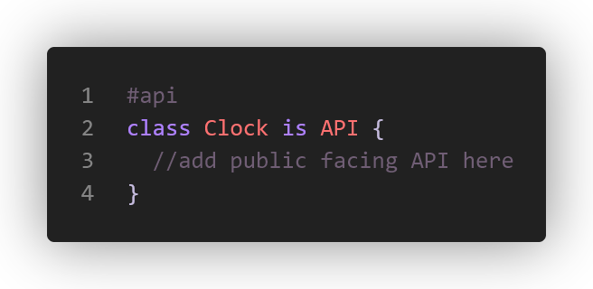

    Here's a more typical example. There's various ways to customize how the modifier is displayed, and user facing info we can show.  
    
    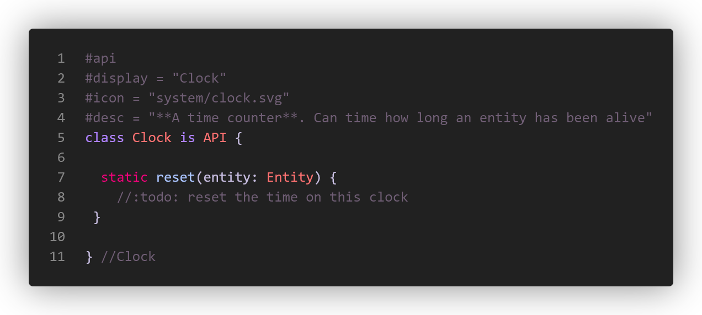

    Now that we've defined a modifier, it already would be visible in the editor/project, 
    and uses the meta data we gave it to display. Since we don't have that icon in place yet, it displays a default one.     
    
    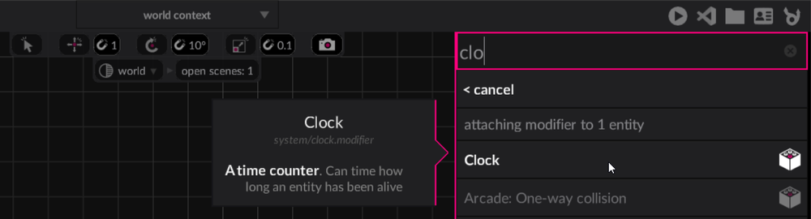

    Once attached, we also get full support of our fields in the editor with no effort:

    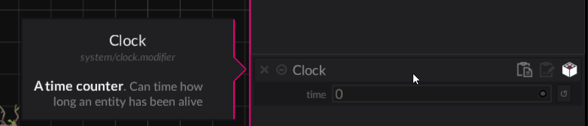

    The API class that ours inherits from `(Clock is API)` does a lot of work for us to make our day easier. 
    Let's reset the time value inside our API function. To do that we use the `get(entity: Entity) : Data` method. 
    This returns the per entity data block for us to use! 

    There's also `system(entity)` which returns our system implementation, and other helpers too. 
    You'll often also find functions like `set_gravity(world: World, ...)` where instead of speaking about 
    the individual entity you're speaking to the system itself, using the world as the key.

    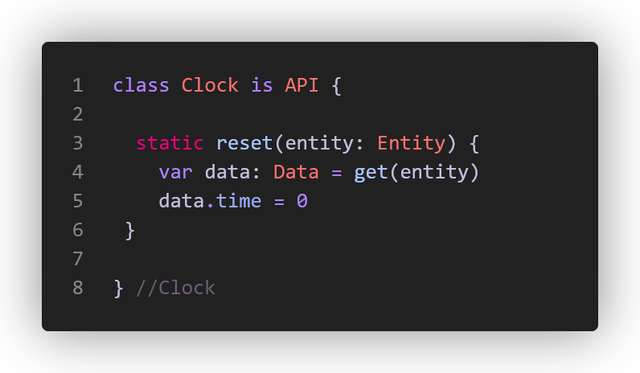

    Since our data type is actually well known, we get full completion:

    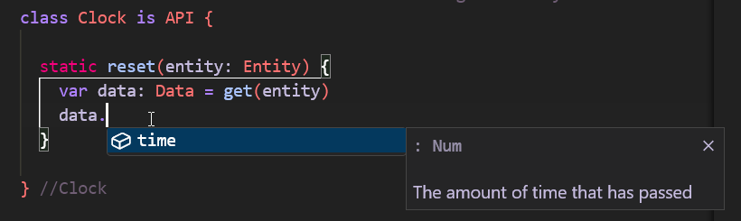

    Also the type is often inferred and shown as an inlay hint, you don't have to explicitly type everything, 
    I am doing it to make things (hopefully) clearer ✨

    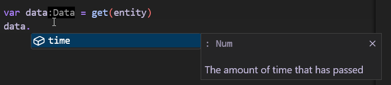

    We also technically didn't need to create the reset function, because the API also has accessors for us that the user can use 
    without us having to expose everything manually. Like `Clock.get.|` and `Clock.set.|`. But of course, many times you want to 
    validate inputs, and do more than just update a value.

    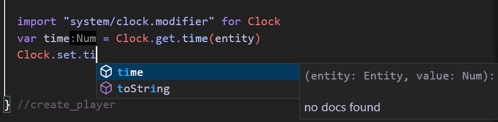

3. #### System implementation

    And finally, our clock needs to actually update the per entity data. We do that in our system implementation. Again let's look at the very minimal one:

    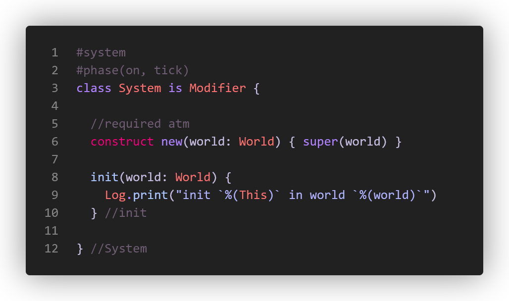

    And this is a more typical look, with the implementation of our actual system where we increase the value of time.

    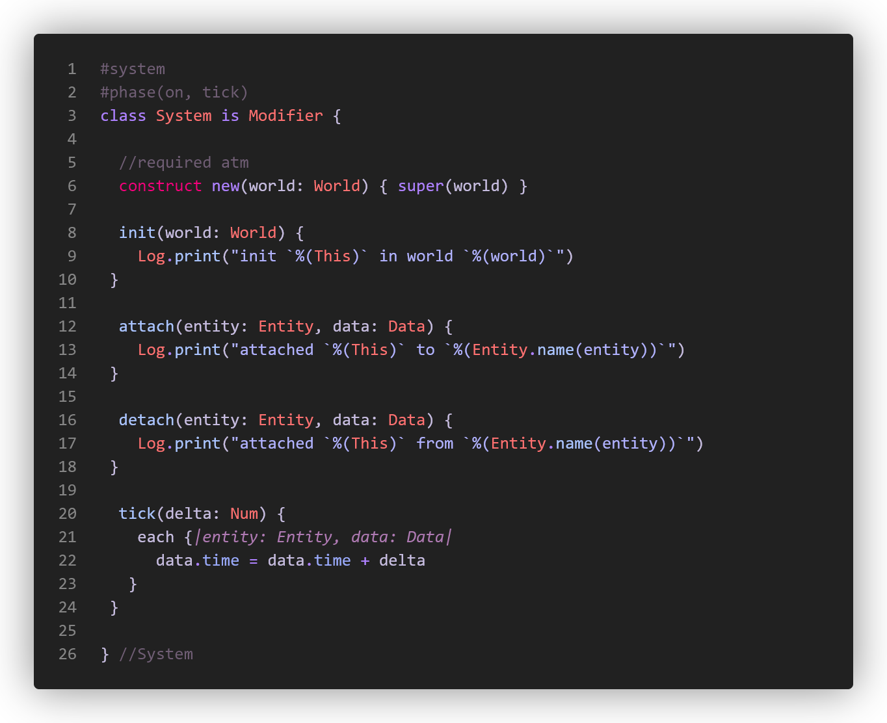

    And here's the full listing of `system/clock.modifier.wren` for clarity.
    
    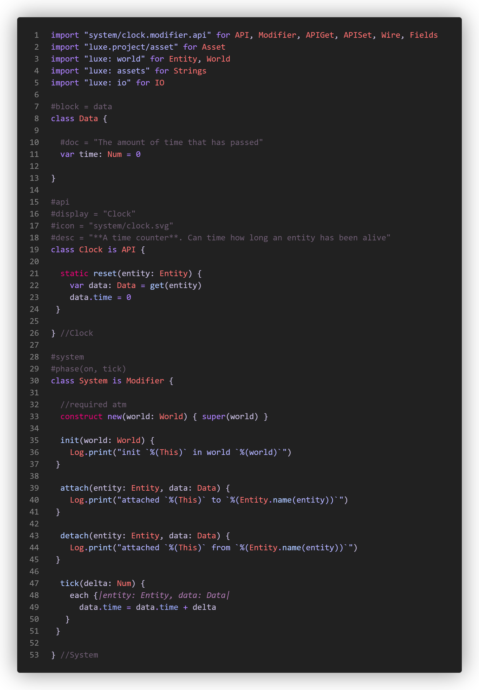

</Steps>

## Systems are singular, attached is plural

Modifiers exist in a world, and there is **one system per world** for a modifier type.

You can attach a modifier to multiple entities, so **your system sees each entity with the modifier attached**.

This is a little different from a 1:1 relationship, and enables gameplay code to be expressive
about multiple things at once easily, but will still be familiar as you typically are still operating per entity.

As an example, a door modifier will be attached to 20 entities in a world, but in that world 
there is only one door modifier system running. **That system knows about all doors** in that world, and 
can answer questions like how many doors are open, without a lot of effort/searching on the game side.

### Editor only code

Modifiers can also run custom code in the editor, allowing custom behaviour between editor and the game.
Any of the system functions (init, attach, etc) have an `editor_` prefixed equivalent as well.

Here's an example from the Arcade modifier, the red shapes (collision) and black outlines (spatial hash) show up in the editor.

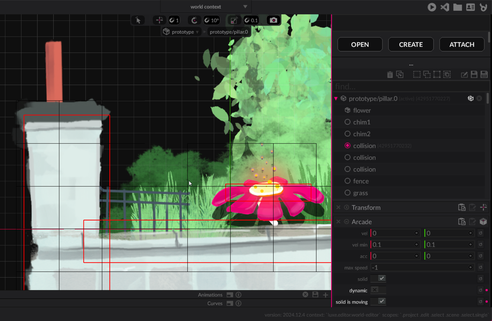

:::tip[Granularity]{icon="puzzle"}
It's an intentional design decision in luxe that we are interested in systems that provide modular behaviour more than we are interested in very granular data.

This is guiding principle/convention, but games can still get pretty granular with their systems.
:::


## Data field types

:::caution[Docs WIP]
These will get documented nicely, but here is a dump of the types and examples available
to systems. Some of these have rough edges and will change slightly (nothing major).
:::


```js
#block = data
class Data {

  #display = "Number (count)"
  var number : Num = 11
  #display = "name"
  var string : String = "luxe" 
  var enum : MyTextAlign = MyTextAlign.bottom //defined below
  var uuid : UUID = null
  var link : Link = null //a reference to an entity in the editor/scene
  var color : Color = [1,1,1,1]
  var float2 : Float2 = [1,1]
  var float3 : Float3 = [1,1,1]
  var float4 : Float4 = [1,1,1,1]
  var boolean : Bool = true

  //Asset types have a type stored in the #tag 
  //so that the editor can show just the type you care about

  #tag = "luxe: type/scene.asset"
  var scene_to_load : Asset = "some/asset"

  //Strings can be tagged to add an OS file picker
  //with `path`, `path.open`, `path.save`, and `path.folder`
  
  #tag = "path.folder"
  var project_location: String = ""

  //Show if can hide fields that aren't relevant
  //based on the value in another option field.
  //So this field will only be visible in the UI if the enum is 
  //set to MyTextAlign.center in the UI 

  #show_if(enum = center)
  var other : Num = 22
  
  //Arrays
  
  //They have a count for efficiency,
  //the count isn't a limit. It's how much
  //space to reserve for your common use case,
  //which will make operating on this field faster.

  //For now, we specify the type as a tag on the field,
  //this will be improved later.
  //Any primitive array can have a default

  #count = 4
  #type = Num
  var array_number : List = [22, 33, 44, 55]

  #count = 2
  #type = MyTextAlign
  var array_enum : List = [MyTextAlign.center]

  //No defaults for objects here, 
  //defaults are defined in the object itself
  var obj : Obj = Object
  
  //Arrays of objects are valid too,
  //and they work similarly, they can't
  //have a default here. The list can 
  //have an empty default though

  #count = 1
  #type = Obj
  var obj_array : List = []

  //Groups
  //Any consecutive fields with the same group tag 
  //will be collected together in a collapsible group

  #group="Stuff Together"
  var hey : Num = 99.0
  #group="Stuff Together"
  var hi : String = "how?" 

  #group="Other Together"
  var why : Num = 99.0
  #group="Other Together"
  var here : String = "how?" 

}

//option tag is required
#option
class MyTextAlign {
  static left { "left" }
  static center { "center" }
  static right { "right" }
  static top { "top" }
  static bottom { "bottom" }
}

//Objects have the same types as above
class Obj {
  var other: Num = 1
  var some: String = "fields"
  var here: Color = [111,112,113,114]
  var yea: Float2 = [11, 12]
}
```


To be continued...
