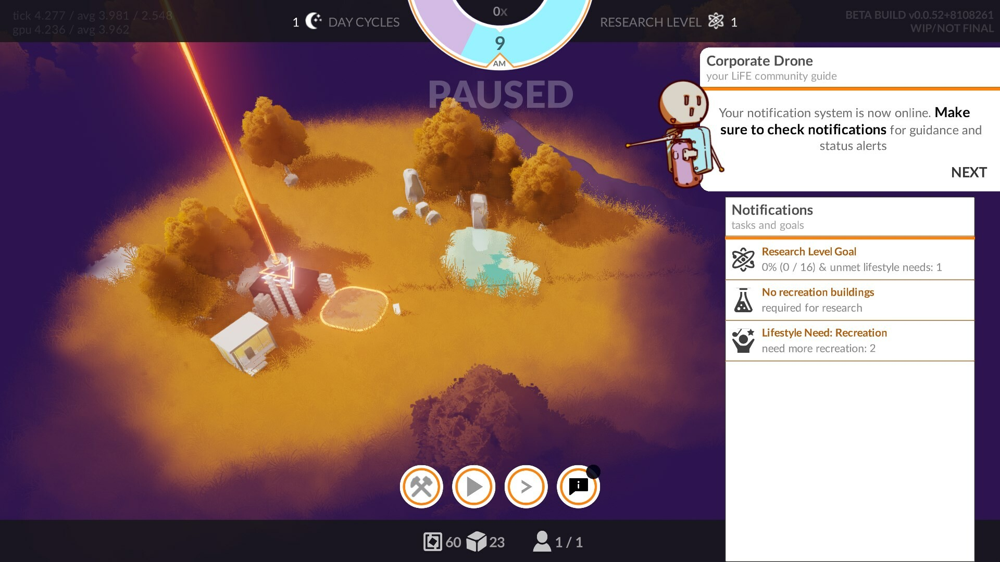
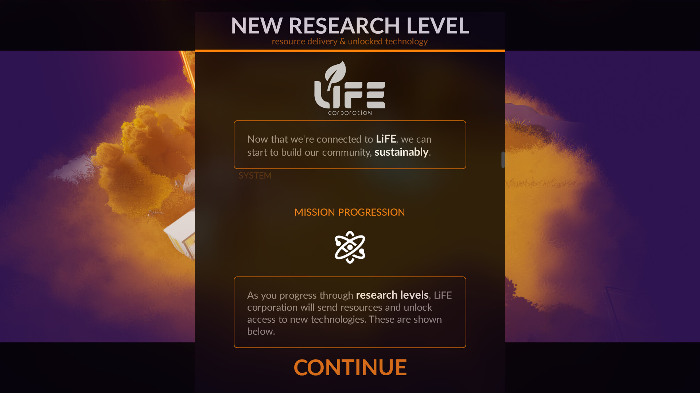
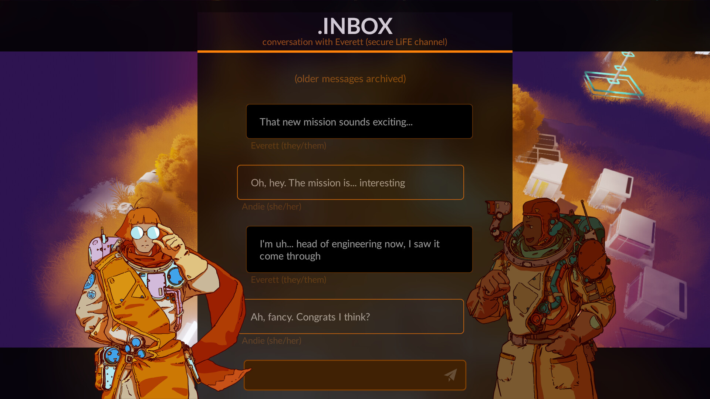
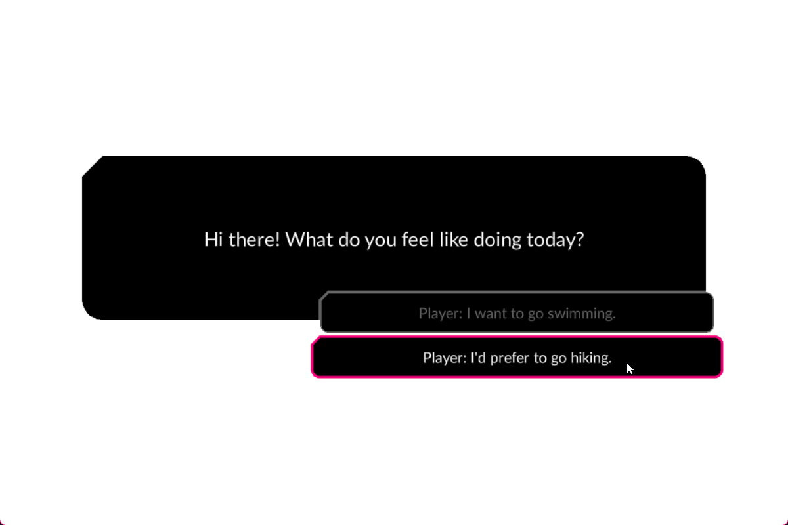

import { Badge } from '@astrojs/starlight/components';

<Badge text="Complexity: low" variant="success" />
<Badge text="Module" variant="tip" />
<br/><br/>

:::tip[Outcome / Goals]{icon="puzzle"}
In this tutorial we'll:
- Learn about the Yarn module
- See how to use it to implement dialogue in our game
:::

:::note
The dialogue module is work in progress. We'd like to add some more helpers to make it easier to use out the box.
:::

## Dialogue via the yarn module

Add the `yarn` module to your project to get started.

## Yarn syntax 

The dialogue engine provided by the yarn module is based on the [Yarn Spinner](https://www.yarnspinner.dev/) tool. 
The [documentation on syntax](https://docs.yarnspinner.dev/write-yarn-scripts/scripting-fundamentals/lines-nodes-and-options) would still be useful even if there are minor differences.

## Dialogue is a modifier

Dialogue exists within a `World`, and is attached to an `Entity` like other modifiers.

```wren
import "yarn: system/dialogue.modifier" for Dialogue

var talk = Entity.create(world)
Dialogue.create(talk) 
```

This means you can have many dialogue instances in the world at the same time, and each one has it's own state.

For example, you might have a character with a complex interaction where they can continue where they left off easily, 
without other instances affecting it, even if there are other dialogues happening in between, just by keeping the entity alive.

## Hello dialogue 

Create a new blank file in your project, like `dialogue/hello.yarn`.

```yarn
//dialogue/hello.yarn

title: Hello
---
NPC: Words!? I am speaking... can you hear me?
-> Player: Yes.
    NPC: Great!
-> Player: No.
    NPC: At least we tried!

===
```

You'll see the syntax is fairly simple to understand, we can tell that there is a line of dialogue and then some options the player can choose from.

If you build your project, you'll notice that the module has modified your file and added some meta data for each line/option.

```yarn
//dialogue/hello.yarn

title: Hello
---
NPC: Words!? I am speaking... can you hear me? #line:yarnurgGybypCO
-> Player: Yes. #line:yarnE2afj5R9s54
    NPC: Great! #line:yarn29YQPd7vjfW
-> Player: No. #line:yarn6xXIn9FzxbS
    NPC: At least we tried! #line:yarnAMJ7AVon7sT

===
```

## Running the dialogue 

To run a yarn file, we use the start function, which takes a yarn file and a node within the yarn file (you'll learn about nodes later).   
<small>`:todo: We'll convert this to Asset.yarn(...) instead of a string soon`</small>

```wren
Dialogue.start(talk, "dialogue/hello", "Hello")
```

## Seeing the dialogue 

If you ran this, you won't really see anything happening because:

- There's nothing to display the dialogue on screen or elsewhere
- There's no input to progress the dialogue or make choices

### Dialogue views 

In order to display dialogue, we need to add a **Dialogue View** to display it. 

The system works with multiple views, which allows us to organize our code a lot cleaner. 

For example you might have a `VoiceOverView` that handles playing the voice over audio, 
an `OptionsView` to handle displaying the options to the player, and a `MessageView` for displaying dialogue.

Often in games you might have a few different ways! For example in our game we have a few different uses:

The drone view is a small pop up top right, and has voice over.



We also have a view that displays game progression at each milestone, which also uses yarn.



And of course, we have dialogue where two character talk, their poses are controlled by the yarn files, and the messages are displayed like a chat application.



### PrintView 

From the yarn module sample, you'll find an empty dialogue view that prints the dialogue to the log.
This gives you an idea of events the view is sent.

You can save this in your project to play around with it.

```wren
//script/views/print.wren

import "yarn: view" for DialogueView, LineStatus

class PrintView is DialogueView {

  var select: Fn = null 

  construct new() {}

  on_dialogue_started() { Log.print("dialogue: started!") }
  on_dialogue_complete() { Log.print("dialogue: complete!") }
  on_line_status_changed(line: Line) {
    Log.print("dialogue: line changed status to `%(LineStatus.name(line.status))`")
  }

  run_line(line: Line, on_line_finished: Fn) {
    select = null
    Log.print("%(line.text)")
    on_line_finished.call()
  }

  run_options(options: List, on_option_selected: Fn) {
    for(option in options) {
      Log.print("  -> %(option.index) - %(option.line.text)")
    }
    select = on_option_selected
  }

  dismiss_line(on_dismiss_finished: Fn) {
    on_dismiss_finished.call()
  }

  choose(option: Num) {
    if(select) select.call(option)
    select = null
  }

  ready_for_next_line() {}

}
```

Right after creating the dialogue, we can add the view to it:

```wren
Dialogue.create(talk) 
Dialogue.add_view(talk, PrintView.new())
```

Now when we run the dialogue with start, it should print the first line to the console.

### Interaction

The dialogue will wait to progress until it's told to continue. Your view can choose to automatically progress the dialogue as well internally.

To tell the dialogue we're ready to progress, we use `ready_for_next_line`.

```wren
Dialogue.ready_for_next_line(talk) 
```

And to tell the dialogue which choice the player made from the list of options we can use `choose`.
The number is the index of the option from the list given to your view when receving options.

```wren
Dialogue.choose(talk, 0) 
```

## Full example 

To view a full example including visual views (made with `Draw`), the yarn module provides a sample alongside the module.

If you use the luxe launcher to view the module, open folder on it, and look inside `samples/`.



## Conclusion

We'd like to add some more helpers and views to make it easier to use out the box and get started right away.
We'll add these in future.
