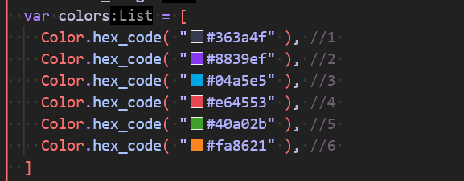
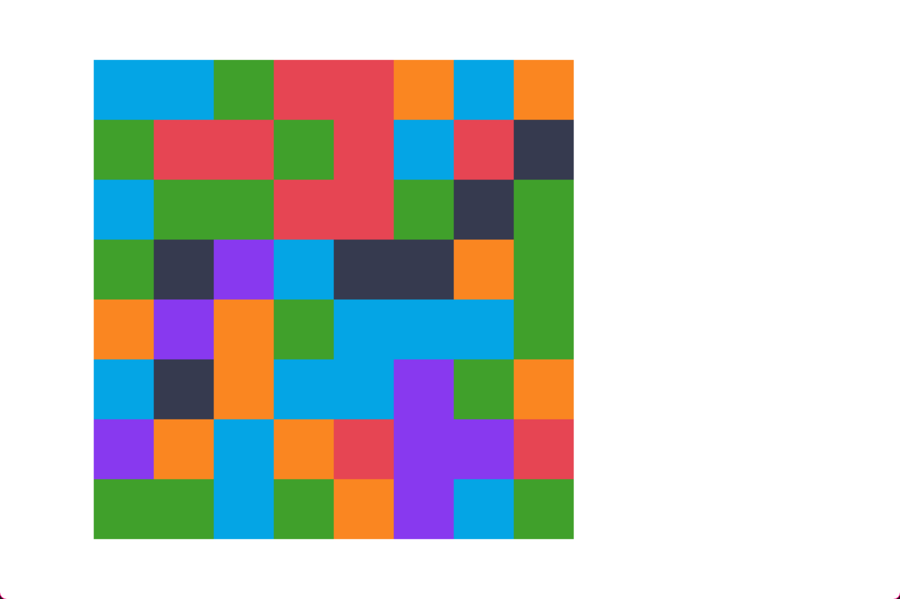
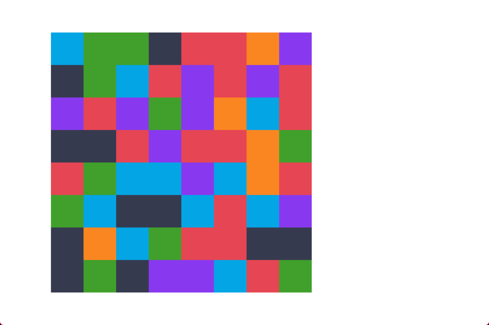
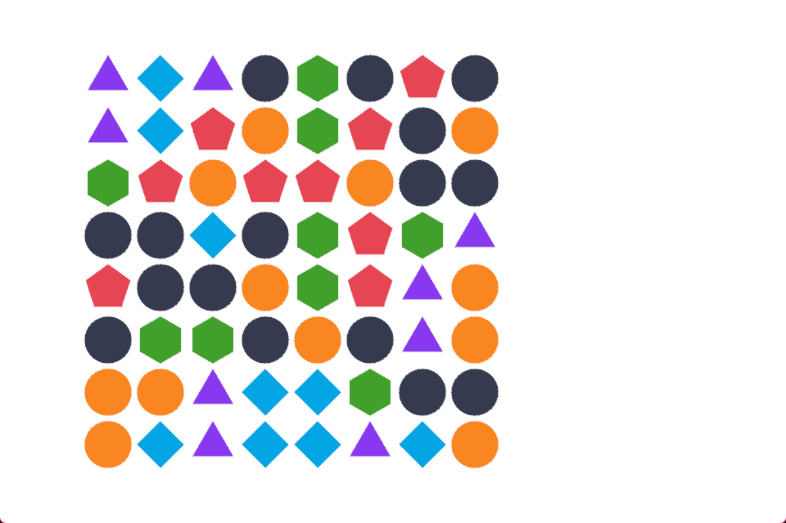
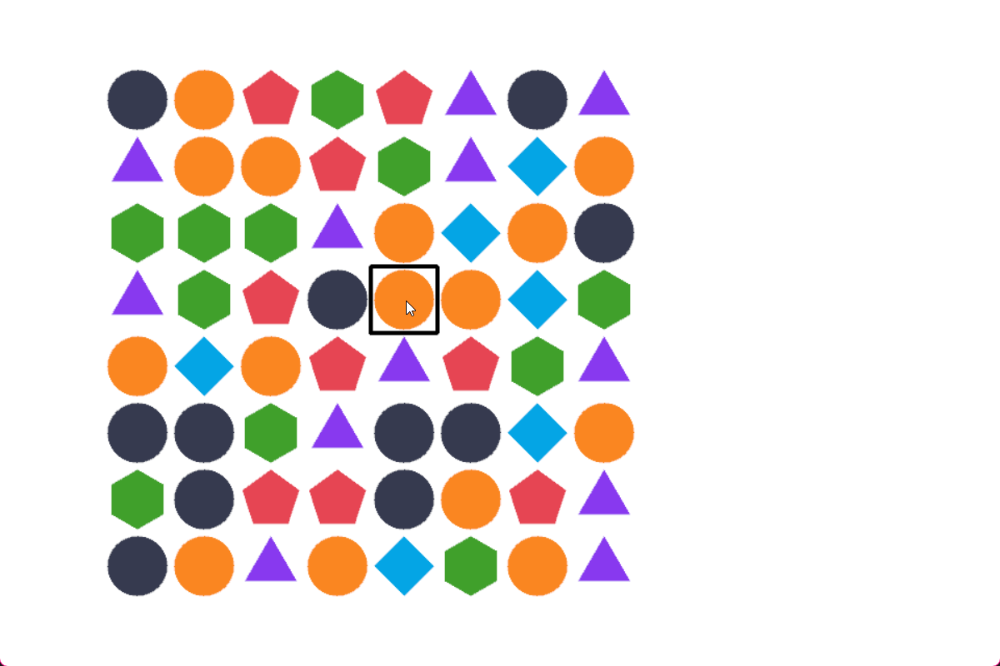
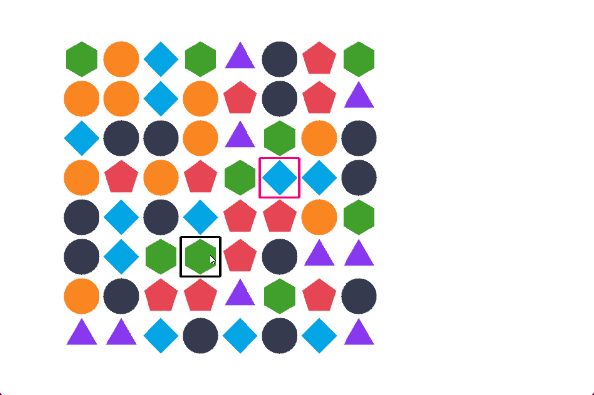

import { Steps } from '@astrojs/starlight/components';
import { Badge } from '@astrojs/starlight/components';

<Badge text="Complexity: low" variant="success" />
<Badge text="Game Tutorial" variant="tip" />
<br/><br/>

:::tip[Outcome / Goals]{icon="puzzle"}
In this tutorial we'll:
- Make a simple match 3 game grid
- Visualize the grid using `Draw`
- Add mouse input to test the game
- Add the Swap, Matching, Dropping, Filling mechanics
- Add cascading matches + a bonus 'has any moves' function
:::

## Moving parts

Let's think about the game we're making and decide how we're going to structure it.
In luxe we have several tools we can use like Modifiers, Prototypes, Scenes and so on, which do we use for this game?

The game consists of:
- A grid with the state of the game board (logic)
- Visuals to represent that grid state
- A potential (very simple) hud to display the score

## Project phases

We're going to approach this in phases:

- We'll start simple with the logic parts of the game
  - Then we use `Draw` to visualize the state of the board
- Then we'll make it so we can wait on logic to animate changes
  - This will use Wren Fibers - a concept that allows us to pause code logic
- Lastly we'll convert it to use the world systems
  - So we can use Sprite, Anim, and more to make it nicer

This should allow us to see a journey from a prototype to a game while keeping the same core concepts.

## Create the project

We'll start this project using the **Empty** project outline.

Let's delete all the logo code, leaving our game an empty class like this:

```wren
class Game is Ready {

  construct ready() {

    super("ready! %(width) x %(height) @ %(scale)x")

  } //ready

  tick(delta: Num) {

    if(Input.key_state_released(Key.escape)) {
      IO.shutdown()
    }

  } //tick

} //Game
```

## The grid system

Since we know that our later goal is to use the world systems, we're going to start by making our grid a modifier.
It could just as well be plain class, but we don't have to rewrite a lot of stuff over and over.

What's important is thinking about how we work so that we don't paint ourselves into a corner!

<Steps>

1. #### `system/`

    Create an empty **folder** named `system/` in the project folder.

2. #### `system/grid.modifier.wren`

    Create an empty **file** named `grid.modifier.wren` in the new `system/` folder.

3. #### Run the build

    This will generate the contents for you to edit.

3. #### Edit details

    We update our system definition with some details.

    ```wren ins="Grid" ins="Match3 Grid" ins="**A match 3 grid**. Contains the core logic and grid state of the game"
      #api
      #display = "Match3 Grid"
      #desc = "**A match 3 grid**. Contains the core logic and grid state of the game" 
      #icon = "luxe: image/modifier/modifier.svg"
      class Grid is API {
        //add public facing API here
      }
    ```

</Steps>

## Grid data 

Now we can think about our Modifier data, what do we need for a match 3 game grid?
If we imagined creating a match3 grid as a modifier and editing the properties, we
can think of settings the user might want to control:

- A width and height
- A number of unique block types the grid can hold
- A 2D grid of numbers to store the game state

:::caution[Remember!]
Luxe data blocks have special rules and can't use normal wren types!
So we have to think in terms of data block types.
:::

For the grid state, we'll use an array of objects in the block data.
To do that we'll also define another data block class to use! 

```diff lang=wren
#block = data
class Data {

  #doc = "The height of the grid (in cells)"
  var width: Num = 8
  #doc = "The width of the grid (in cells)"
  var height: Num = 8
  #doc = "The number of distinct block types"
  var block_kinds: Num = 6

  #no_inspector
  #count = 8
  #type = GridRow
  var rows: List = []

}

class GridRow {
  #count = 8
  #type = Num
  var columns: List = []
}
```

## Initialize the grid data 

Inside `attach` we can initialize our grid data. 

```diff lang=wren
attach(entity: Entity, data: Data) {
  Log.print("attached to `%(Entity.name(entity))` `%(entity)` - `%(This)`")

+  //create the grid data
+  for(y in 0 ... data.height) {
+    var row: GridRow = data.rows.add()
+    for(x in 0 ... data.width) {
+      row.columns.add(0)
+    }
+  }

}
```

## Visualize the grid 

Even though it's empty, it can still be much easier to reason about our changes if we can visualize them on screen.

To do that we're going to need a few imports at the top of your `grid.modifier.wren` file:

```wren
import "luxe: input" for Input, MouseButton, Key
import "luxe: draw" for Draw, PathStyle
import "luxe: world" for Camera
import "luxe: color" for Color
import "random" for Random
```

And inside our system, we'll create a draw context, and a random number generator, and some colors and sizes for debugging the board:

```diff lang=wren
class System is Modifier {

+  var draw: Draw = null
+  var style: PathStyle = PathStyle.new()
+  var rng: Random = Random.new()
+
+  //debug visualization
+  var grid_left = 100
+  var grid_bottom = 64
+  var block_width = 64
+  var block_height = 64
+  var colors = [
+    Color.hex_code( "#363a4f" ), //1 
+    Color.hex_code( "#8839ef" ), //2 
+    Color.hex_code( "#04a5e5" ), //3 
+    Color.hex_code( "#e64553" ), //4 
+    Color.hex_code( "#40a02b" ), //5 
+    Color.hex_code( "#fa8621" ), //6 
+  ]

  //required atm
  construct new(world: World) { super(world) }

  init(world: World) {
    Log.print("init `%(This)` in world `%(world)`")

+    draw = Draw.create(World.render_set(world))
+    style.color = Color.black
+    style.thickness = 4
  }
```

Because we put the # color code there, the code editor (vscode) can show us the color!



:::tip 
These colors come from the catppuccin palettes: https://catppuccin.com/palette/
:::

### Fill the grid with random values

In our `attach` we can change the `0` we used to a random value:

```wren ins="1 + rng.int(data.block_kinds)"
for(y in 0 ... data.height) {
  var row: GridRow = data.rows.add()
  for(x in 0 ... data.width) {
    row.columns.add( 1 + rng.int(data.block_kinds) )
  }
}
```

### Draw the grid 

Let's create a helper function to convert the grid coordinate spaces to world space.

Somewhere in your `System` class add these two functions:

```wren
world_to_grid(data: Data, x: Num, y: Num) {
  var grid_h = data.height * block_height
  var grid_x = ((x - grid_left) / block_width).floor
  var grid_y = ((y - grid_bottom) / block_height).floor
  //now invert the Y because we were in y+ up world
  grid_y = (data.height - 1) - grid_y

  return [grid_x, grid_y]
}

grid_to_world(data: Data, x: Num, y: Num) {
  //we subtract because y+ is up, 
  //and we add 1 because we want the bottom left
  //(not top left) for world space!
  return [
    grid_left + (x * block_width),
    grid_bottom + ((data.height - y - 1) * block_height)
  ]
}
```

Now we can jump to our `tick` method, and using `Draw` we can draw the state of the grid.
This requires looping over the grid, first along the rows (y) and then across the columns (x).
We can then fetch the random value from the grid, use it to pick the color, and draw a box.

:::note
We'll add shapes soon so it's easier to distinguish without color alone.
:::

```diff lang=wren
tick(delta: Num) {

+  each {|entity: Entity, data: Data|
+
+    for(y in 0 ... data.height) {
+
+      var row: GridRow = data.rows[y]
+
+      for(x in 0 ... data.width) {
+        
+        var kind = row.columns[x]
+        if(kind == 0) continue
+
+        var color = colors[kind - 1]
+        var pos = grid_to_world(data, x, y)
+        Draw.quad(draw, pos.x, pos.y, 0, block_width, block_height, 0, color)
+
+      } //each column
+    
+    } //each row
+
+  } //each entity
+
+  Draw.commit(draw)

}
```

## Adding an instance in `game.wren`

If we ran this... there would be nothing shown. That's because we never attached our modifier to an Entity.

Inside `game.wren` we'll import and create a grid instance.

```diff lang=wren
+import "system/grid.modifier" for Grid

class Game is Ready {

  var grid: Entity = Entity.none

  construct ready() {

    super("ready! %(width) x %(height) @ %(scale)x")

+    grid = Entity.create(world, "grid")
+    Grid.create(grid)

  } //ready

  ...

} //Game
```

Now if we run the game, we can see that it shows a grid of random colors!



## Fill the grid nicely

There's an interesting issue that comes up with randomness, is that things can repeat.
In a match 3, the starting grid ideally shouldn't already have matches. 

If we look at our image, it has quite a few!

Let's fix that.

### Grid helper functions

Before we continue, let's add a few helper functions to make our grid logic easier.
Add these functions to your `System` class. Each one should be self explanatory!

```wren
in_grid(data: Data, x: Num, y: Num) : Bool {
  if(x < 0 || x >= data.width) return false
  if(y < 0 || y >= data.height) return false
  return true
}

set_cell(data: Data, x: Num, y: Num, kind: Num) : Bool {
  if(!in_grid(data, x, y)) return false
  var row: GridRow = data.rows[y]
  row.columns[x] = kind
  return true
}

get_cell(data: Data, x: Num, y: Num) : Num {
  if(!in_grid(data, x, y)) return false
  var row: GridRow = data.rows[y]
  return row.columns[x]
}

is_adjacent(x1: Num, y1: Num, x2: Num, y2: Num) : Bool {
  var dx = (x1 - x2).abs
  var dy = (y1 - y2).abs
  return (dx == 1 && dy == 0) || (dx == 0 && dy == 1)
}
```

### Resetting the grid safely

Let's make a `reset_grid` function that will try to fill it without matches.

First we're going to change our `attach` method. Put the 0 back as the default value, and then add a call to `reset_grid`.

```diff lang=wren ins="(0)"
  attach(entity: Entity, data: Data) {
    Log.print("attached to `%(Entity.name(entity))` `%(entity)` - `%(This)`")

    //create the grid data
    for(y in 0 ... data.height) {
      var row: GridRow = data.rows.add()
      for(x in 0 ... data.width) {
+        row.columns.add(0)
      }
    }

+    reset_grid(data)
  
  }
```

Then we can make a `fill_grid` function, adding it to our `System` class.

```wren
reset_grid(data: Data) {
  for (y in 0 ... data.height) {
    for (x in 0 ... data.width) {
      var kind = safe_tile(data, x, y)
      set_cell(data, x, y, kind) 
    }
  }
}
```

And finally we'll need that `safe_tile` function.

Because we're filling the grid in one row at a time, and one column at a time, 
we can look to our left and above to check if there's a match. If there is, we try another kind.
We repeat that up to 10 times, and if we fail, then that's fine.

Add this to your `System` class as well:

```wren
//Safe tile prevents filling the grid with matches
//by checking for matches while choosing a random kind
safe_tile(data: Data, x: Num, y: Num) {
  
  //pick a random kind to start
  var kind = rng.int(data.block_kinds) + 1
  
  var tries = 0
  while (tries < 10) {
    var match = false
    
    // check for horizontal matches
    if(x >= 2) {
      var left1 = get_cell(data, x - 1, y)
      var left2 = get_cell(data, x - 2, y)
      if (left1 == kind && left2 == kind) {
        match = true
      }
    }
    
    // check for vertical match
    if (y >= 2) {
      var above1 = get_cell(data, x, y - 1)
      var above2 = get_cell(data, x, y - 2)
      if(above1 == kind && above2 == kind) {
        match = true
      }
    }
    
    // no matches, this is a safe kind to create at this position
    if (!match) return kind
    
    // if not safe, try again
    kind = rng.int(data.block_kinds) + 1
    tries = tries + 1
  }
  
  //if we run out of tries, just return it anyway
  return kind

} //safe_tile
```

That's much better! There's no visible matches at the start of our grid.



## Shapes + Color 

Color alone isn't always enough information. Some people can't percieve all colors, and sometimes they are a bit too similar and hard to tell apart.

What we can do is draw shapes instead, which will make it a lot easier to see what's going on.

Alongside our list of colors, we can add a list of sides. A triangle has 3 sides, a square has 4, and so on. We use 32 to approximate a circle for now.

```diff lang=wren
  var block_height = 64  
+  var sides = [32, 3, 4, 5, 6, 32]
  var colors = [
```

Change the drawing code inside of `tick` to this instead:

```wren
var pos = grid_to_world(data, x, y)
var color = colors[kind - 1]
var sides = sides[kind - 1]
var half_width = block_width / 2
var half_height = block_height / 2
var radius_x = half_width * 0.9
var radius_y = half_height * 0.9

Draw.ngon_solid(draw, pos.x + half_width, pos.y + half_height, 0, radius_x, radius_y, sides, 90, color)
```



That's starting to look like a game. Let's get started on the game logic!

## Debug input

In order to test the game logic, we really should have the ability to affect the game. 

We'll do that by using the mouse to interact with the game.
When we click, it'll mark the cell as selected, and when we click an adjacent cell, it will swap them.

### Mouse conversions

The start we'll draw a mouse cursor on the grid. 
We have to convert between a few spaces here:
- From window space (`Input.mouse_x()`) to world space (using Camera)
- Then from world space to grid space
- And to draw it, from grid space back to world space

We also make sure we track if it's inside the grid, because we don't need to interact outside of it.

Add the code to `tick` like this:

```diff lang=wren
tick(delta: Num) {

+  var mouse = Camera.screen_point_to_world(
+    Camera.get_default(world), 
+    Input.mouse_x(), 
+    Input.mouse_y())

  each {|entity: Entity, data: Data|

+    var grid_mouse = world_to_grid(data, mouse.x, mouse.y)
+    var valid_mouse = in_grid(data, grid_mouse.x, grid_mouse.y)
+
+    if(valid_mouse) {
+      var mouse_draw_pos = grid_to_world(data, grid_mouse.x, grid_mouse.y)
+      Draw.rect(draw, 
+        mouse_draw_pos.x, mouse_draw_pos.y, 0, 
+        block_width, block_height, 0, style)
+    }

    for(y in 0 ... data.height) {
      ... //existing code 
    } //each row

  } //each entity

  Draw.commit(draw)
}
```

Now whenever we move the mouse, this square will follow.



### Selected state 

We'll track the selected state in our `Data` class. We use -1 to mean "nothing selected".

```diff lang=wren
class Data {

  ... //existing code 

+  #doc = "Currently selected cell"
+  var selected: Float2 = [-1,-1]

}
```

When a mouse click happens:
- If we had a selection
  - and clicked on the same spot, deselect
  - clicked somewhere else, check if we can swap
- If we didn't have a selection
  - select it

We can add to the tick function

```diff lang=wren
each {|entity: Entity, data: Data|

  var grid_mouse = world_to_grid(data, mouse.x, mouse.y)
  var valid_mouse = in_grid(data, grid_mouse.x, grid_mouse.y)

+  var selected = data.selected
+  var had_selected = selected.x != -1 && selected.y != -1
+  if(had_selected) {
+    var selected_pos = grid_to_world(data, selected.x, selected.y)
+    Draw.rect(draw, 
+      selected_pos.x, selected_pos.y, 0, 
+      block_width, block_height, 0, style.color(Color.pink))
+  }

  if(valid_mouse) {
    var mouse_draw_pos = grid_to_world(data, grid_mouse.x, grid_mouse.y)
    Draw.rect(draw, 
      mouse_draw_pos.x, mouse_draw_pos.y, 0, 
      block_width, block_height, 0, style.color(Color.black))

+    if(Input.mouse_state_released(MouseButton.left)) {
+      if(had_selected) {
+        var allow_swap = is_adjacent(selected.x, selected.y, grid_mouse.x, grid_mouse.y)
+        if(selected.x == grid_mouse.x && selected.y == grid_mouse.y) {
+          data.selected = [-1, -1]
+        } else if(allow_swap) {
+          // swap(selected.x, selected.y, grid_mouse.x, grid_mouse.y)
+          data.selected = [-1, -1]
+        }
+      } else {
+        data.selected = grid_mouse
+      }
+    } //if left click
    
  } //if valid mouse

  ...
} // each
```

We can now select a grid cell, deselect it, and see the mouse and the selection at the same time:



## Swap 

One of the most important concepts of the game, is being able to swap two pieces on the grid!

So let's implement it but with a small bit of nuance. We're going to split our swap into two parts, 
the initial step, and a 'complete' step. This is for the future, because we're going to want to be able to animate the swap visually.

For now, we'll immediately call `complete_swap` anyway. Add these to your `System` class.

```wren
swap(data: Data, x1: Num, y1: Num, x2: Num, y2: Num) {
  if (!is_adjacent(x1, y1, x2, y2)) return false
  complete_swap(data, x1, y1, x2, y2)
}

complete_swap(data: Data, x1: Num, y1: Num, x2: Num, y2: Num) {
  var temp = get_cell(data, x1, y1)
  set_cell(data, x1, y1, get_cell(data, x2, y2))
  set_cell(data, x2, y2, temp)
}
```

Here's what that looks like now:   

<video preload="auto" autoplay controls muted playinsline loop="loop" style="max-width:100%; width:auto; margin:auto; display:block;">
  <source src="/video/tutorials/match3/swap.mp4" type="video/mp4"></source>
</video>

## Finding matches

The next important piece of logic for the game is finding where we have matches on the board.

We'll add a function to our `System` class that will return a list of matched cells to use in the next step.

The function walks horizontally on each row, looking for tiles with a match. Then it does the same for vertical.
It uses a temporary grid to remember which cells it's already looked at (`marked`).


```wren
//return a list of matches found on the grid
find_all_matches(data: Data) : List {

  var matches = []
  var marked = List.filled(data.height, null)
  for (i in 0...data.height) {
    marked[i] = List.filled(data.width, false)
  }
  
  // check for horizontal matches
  for (y in 0 ... data.height) {
    var x = 0
    while (x < data.width) {
      var kind = get_cell(data, x, y)
      if (kind == 0) {
        x = x + 1
        continue
      }
      
      var count = 1
      while (x + count < data.width && get_cell(data, x + count, y) == kind) {
        count = count + 1
      }
      
      if (count >= 3) {
        for (i in 0...count) {
          if (!marked[y][x + i]) {
            matches.add([x + i, y])
            marked[y][x + i] = true
          }
        }
      }
      
      x = x + count
    } //each column
  } //each row

  // check for vertical matches
  for (x in 0 ... data.width) {
    var y = 0
    while (y < data.height) {
      var kind = get_cell(data, x, y)
      if (kind == 0) {
        y = y + 1
        continue
      }
      
      var count = 1
      while (y + count < data.height && get_cell(data, x, y + count) == kind) {
        count = count + 1
      }
      
      if (count >= 3) {
        for (i in 0...count) {
          if (!marked[y + i][x]) {
            matches.add([x, y + i])
            marked[y + i][x] = true
          }
        }
      }
      
      y = y + count
    }
  }
  
  return matches

} //find_all_matches
```

We'll also call it from `complete_swap`, which is when we check for matches.

```diff lang=wren
complete_swap(data: Data, x1: Num, y1: Num, x2: Num, y2: Num) {
  var temp = get_cell(data, x1, y1)
  set_cell(data, x1, y1, get_cell(data, x2, y2))
  set_cell(data, x2, y2, temp)
  
+  var matches = find_all_matches(data)
+  Log.print("found %(matches.count) matches")
}
```


If we look in the log below the window, we'll see the number of matches being printed:

<video preload="auto" autoplay controls muted playinsline loop="loop" style="max-width:100%; width:auto; margin:auto; display:block;">
  <source src="/video/tutorials/match3/matches.mp4" type="video/mp4"></source>
</video>

## Processing matches

With a list of matches, we need to process them which will remove the state from the grid.
For now we'll immediately clear them from the board.

```wren
process_matches(data: Data) {
  
  var matches = find_all_matches(data)

  while(matches.count > 0) {
    for(match in matches) {
      var x = match[0]
      var y = match[1]
      set_cell(data, x, y, 0)
    }
    
    matches.clear()
  }


} //process_matches
```

And we actually need to call it! We'll add to `complete_swap`:

```diff lang=wren
complete_swap(data: Data, x1: Num, y1: Num, x2: Num, y2: Num) {
  var temp = get_cell(data, x1, y1)
  set_cell(data, x1, y1, get_cell(data, x2, y2))
  set_cell(data, x2, y2, temp)

+  var matches = find_all_matches(data)
+  if(matches.count > 0) {
+    process_matches(data)
+  }
}
```

And now whenever there's a swap, we can see the pieces being removed from the board:

<video preload="auto" autoplay controls muted playinsline loop="loop" style="max-width:100%; width:auto; margin:auto; display:block;">
  <source src="/video/tutorials/match3/process_matches.mp4" type="video/mp4"></source>
</video>

## Dropping blocks 

When we remove blocks from the grid, we typically want the blocks to fall down and fill the empty space below them.

We walk over the grid horizontally, and check for empty tiles. 
If it's empty, we loop vertically and move the items downward.  

```wren
// drop tiles down to fill empty spaces
drop_blocks(data: Data) {
  for (x in 0 ... data.width) {
    var write_y = data.height - 1
    for (y in (data.height - 1) .. 0) {
      if (get_cell(data, x, y) != 0) {
        if (y != write_y) {
          set_cell(data, x, write_y, get_cell(data, x, y))
          set_cell(data, x, y, 0)
        }
        write_y = write_y - 1
      }
    } //each row
  } //each column
} //drop_blocks
```

And inside of `process_matches`, drop the blocks downward after clearing them from the grid.

```diff lang=wren
process_matches(data: Data) {
  
  var matches = find_all_matches(data)

  while(matches.count > 0) {
    for(match in matches) {
      var x = match[0]
      var y = match[1]
      set_cell(data, x, y, 0)
    }

+    //drop tiles downward
+    drop_blocks(data)

    matches.clear()
  }

} //process_matches
```

If you look closely at the grid before and after, you can see the items above the match are moved down to fill the space where the match takes place.

<video preload="auto" autoplay controls muted playinsline loop="loop" style="max-width:100%; width:auto; margin:auto; display:block;">
  <source src="/video/tutorials/match3/dropping_blocks.mp4" type="video/mp4"></source>
</video>

## Filling the gaps 

When blocks fall down, it creates space at the top. We want to fill these spaces with new blocks.

We walk over the grid, if there's an empty space, put something random there.

Here's the function to add to the `System` class:

```wren
//fill in empty spaces created by falling blocks
fill_top(data: Data) {
  for (x in 0 ... data.width) {
    for (y in 0 ... data.height) {
      if (get_cell(data, x, y) == 0) {
        set_cell(data, x, y, rng.int(data.block_kinds) + 1)
      }
    } //each row
  } //each column
} //fill_top
```

And we do need to call it in `process_matches`:

```diff lang=wren
process_matches(data: Data) {
  
  var matches = find_all_matches(data)

  while(matches.count > 0) {
    for(match in matches) {
      var x = match[0]
      var y = match[1]
      set_cell(data, x, y, 0)
    }

+    //drop tiles downward
+    drop_blocks(data)
+    //fill the new spaces made
+    fill_top(data)

    matches.clear()
  }

} //process_matches
```

And if we look closely again (it can be tricky to tell!) the spaces are now filled in.

<video preload="auto" autoplay controls muted playinsline loop="loop" style="max-width:100%; width:auto; margin:auto; display:block;">
  <source src="/video/tutorials/match3/filling_blocks.mp4" type="video/mp4"></source>
</video>

## Cascading changes 

One final piece of gameplay logic is that matches cause blocks to fall, new blocks to spawn, and then more matches can happen as a result.

In `process_matches` we don't clear the matches, we check for new ones!

```diff lang=wren
process_matches(data: Data) {
  
  var matches = find_all_matches(data)

  while(matches.count > 0) {
    for(match in matches) {
      var x = match[0]
      var y = match[1]
      set_cell(data, x, y, 0)
    }

    //drop tiles downward
    drop_blocks(data)
    //fill the new spaces made
    fill_top(data)

+    // cascading changes if we find any more
+    matches = find_all_matches(data)
  }

} //process_matches
```

It's still pretty hard to tell what's happening! Especially when there are multiple rounds of changes!

<video preload="auto" autoplay controls muted playinsline loop="loop" style="max-width:100%; width:auto; margin:auto; display:block;">
  <source src="/video/tutorials/match3/cascading_changes.mp4" type="video/mp4"></source>
</video>

## Bonus logic 

One more piece for a more complete game, is a check if there are any valid moves. 

We can do that by walking the grid, swapping horizontally and looking for matches.
Then we can swap vertically, and look for matches. If we have any along the way, we return true.

(This is how you would handle game over).

You can add this to your `System` class:

```wren
has_valid_moves(data: Data) {

  for (y in 0 ... data.height) {
    for (x in 0 ... data.width) {

      // try swapping with right neighbor
      if (x < data.width - 1) {
        var temp = get_cell(data, x, y)
        set_cell(data, x, y, get_cell(data, x+1, y))
        set_cell(data, x+1, y, temp)

        var matches = find_all_matches(data)
        
        // swap back
        var temp2 = get_cell(data, x, y)
        set_cell(data, x, y, get_cell(data, x+1, y))
        set_cell(data, x+1, y, temp2)
        
        if (matches.count > 0) return true
      }
      
      // try swapping with bottom neighbor
      if (y < data.height - 1) {
        var temp = get_cell(data, x, y)
        set_cell(data, x, y, get_cell(data, x, y+1))
        set_cell(data, x, y+1, temp)
        
        var matches = find_all_matches(data)
        
        // Swap back
        var temp2 = get_cell(data, x, y)
        set_cell(data, x, y, get_cell(data, x, y+1))
        set_cell(data, x, y+1, temp2)
        
        if (matches.count > 0) return true
      }

    } //each column
  } //each row
  
  return false

} //has_valid_moves
```

We can also test it by calling it at the end of `complete_swap`.

```diff lang=wren
complete_swap(data: Data, x1: Num, y1: Num, x2: Num, y2: Num) {
  var temp = get_cell(data, x1, y1)
  set_cell(data, x1, y1, get_cell(data, x2, y2))
  set_cell(data, x2, y2, temp)

  var matches = find_all_matches(data)
  if(matches.count > 0) {
    process_matches(data)
  }

  var has_moves = has_valid_moves(data)
  Log.print("has moves left `%(has_moves)`")
}
```

## Next time!

That's all for this tutorial. 

We have a working match 3 game, but it's a little difficult to understand the changes happening visually.

In the next tutorial, we're going to add animation to the grid changes, so we can see what's actually happening.

