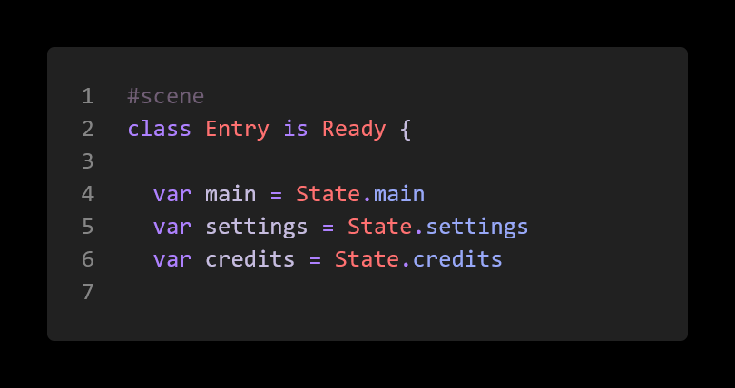
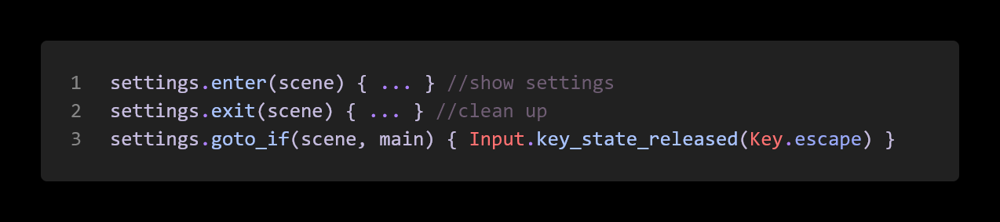
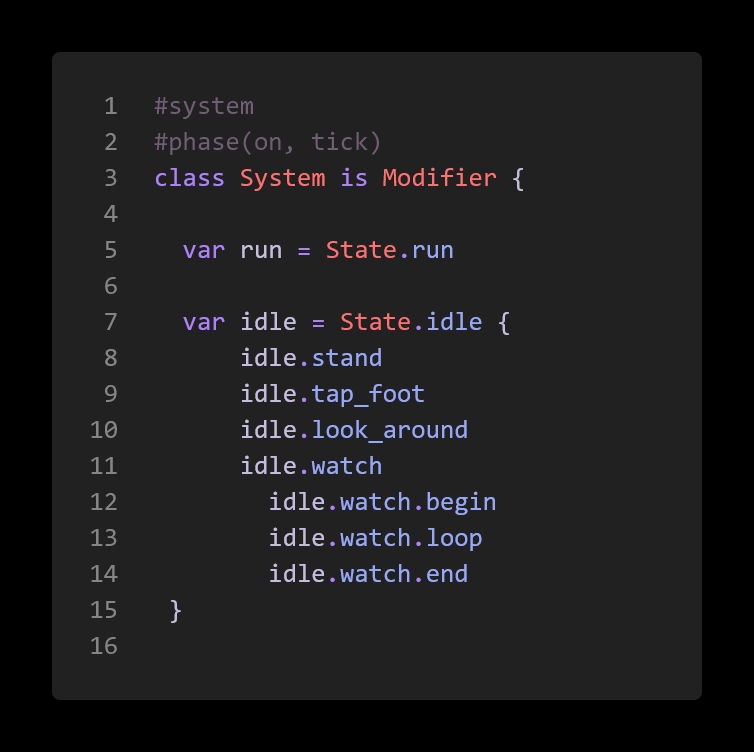
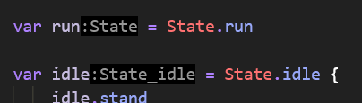
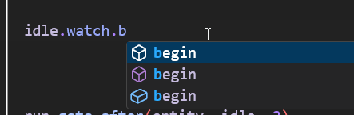
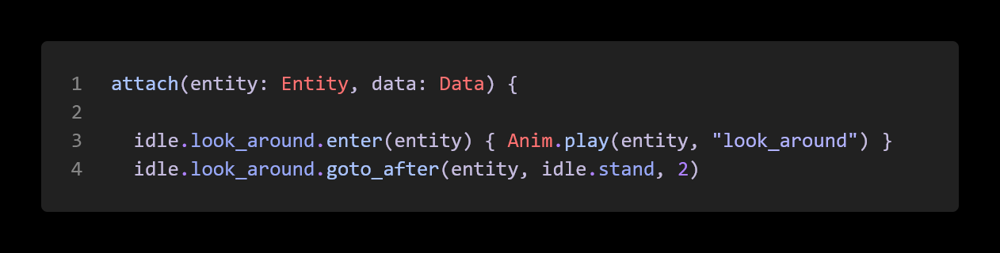
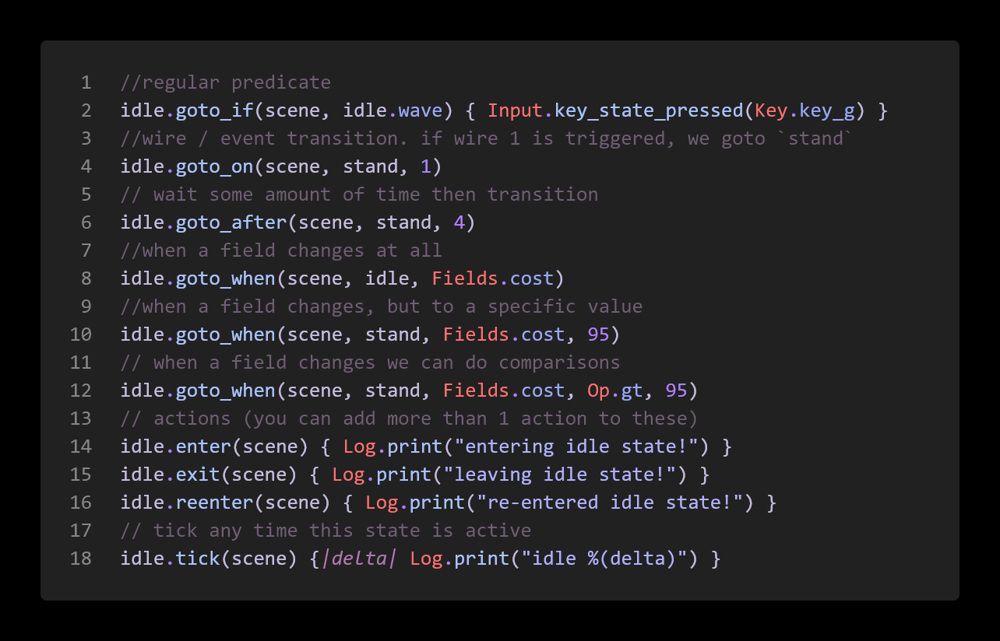

import { Badge } from '@astrojs/starlight/components';

<Badge text="Complexity: low" variant="success" />
<Badge text="Tools" variant="tip" />
<br/><br/>

:::tip[Outcome / Goals]{icon="puzzle"}
In this tutorial we'll:
- Learn about states as a concept
- Create states in a custom modifier
:::

## State machines?

State machines are a useful concept in a lot of use cases, menus, gameplay code, NPC logic and more. 
Scenes and Modifiers in luxe have states built in, which means your systems and game code can easily opt into using them. 
If you don't use them, they don't exist (so no overhead!).

A simple example would be a menu.scene you create, where it might have main, settings, credits states for the menu. 
This is what that looks like right now, in the scene script:



That's it! The names match the variable, this is important for later as we'll see.

Our scene or system also has the states variable, which we use to change states directly like so states.goto(scene, main). 
We do that inside of ready() in a scene script to set the default state. We can also add behaviour to the state, like so:



Here we have a function that's called on entering the state, leaving the state, 
and what we call a transition. This transition is a function that returns true or false, 
and if it does, changes states to the given state (in this case, pressing escape will go back to the main state).

## Nested states

A common pattern that can reduce code complexity and allow sharing more code across states, is nested states. This has different names like nested states, parent states, HFSM (hierarchical finite state machine) and such.

These states typically run at the same time as their child states, allowing the transition code to happen at the parent and be defined once only, and handle specifics in the sub state.

As an example, take an a character that has an idle state. Within our idle state, we might decide to tap our foot, look around nervously, check our watch, wave at someone, and yawn. Each of those can be viewed as a sub state of the idle state. To the 'outside world' we present a simplified interface, we're in the idle state, but within that we're doing all sorts of stuff.

Let's see how we declare that now, and this time we'll do it inside a modifier (per entity we're attached to).



This API is declarative, this code doesn't do anything per se, it just defines the state hierarchy for us! 
This also shows why we use the names, notice how the type of the idle variable is a known type.



That means we get nice completion on our states, like this:



## Simpler states
For the simpler states like looking around or tapping a foot we can do something simple, like this:



## Transition helpers

We've seen `goto_after` but there are a handful of other helpers.

Wires are the event system backbone for scenes and modifiers, so if we receive an event we can use that as a transition. We can also key on our Data class, listening for changes and responding to raw data changes.



## Other notes

We have more transition helpers coming, as well as making it easy to add custom game specific transitions allowing expressive easy to understand declarative gameplay code in the same workflow.

You can mark a state as persistent, root.persists(true) will keep the root state active and running alongside other states. This is useful for 'watcher' states that handle transitions at the higher level.

You can do stuff on reenter, if for example you go from idle.yawn → idle.stand, you're staying in the idle state, so it's not “entering” the idle state, but it does notify that it is reentering.

## Example

```wren
:todo:
```