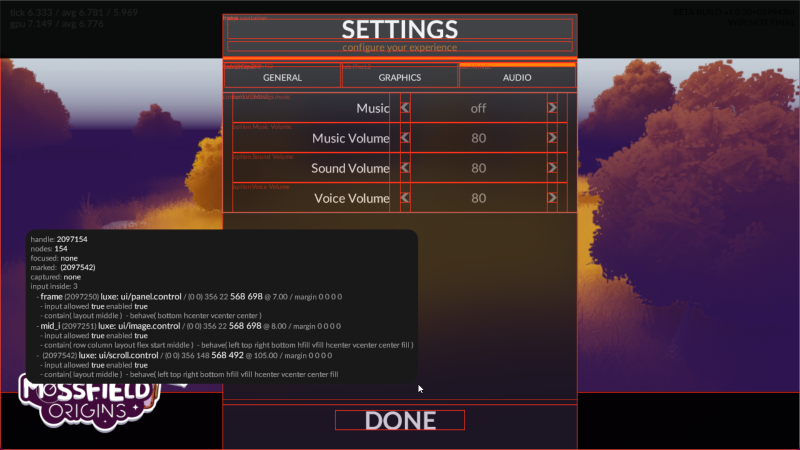
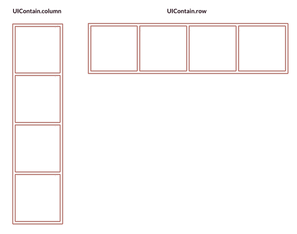

import { Badge } from '@astrojs/starlight/components';

<Badge text="Complexity: low" variant="success" />
<Badge text="Tools" variant="tip" />
<br/><br/>

:::tip[Outcome / Goals]{icon="puzzle"}
In this tutorial we'll:
- Learn how to use the UI modifier from code
- How to do flexible layout in the UI 
- How to create UI in the world editor
:::

## UI is a Modifier

UI exists within a `World`, and is attached to an `Entity` like other modifiers.

When you create a UI on an `Entity`, you're creating a _canvas_.
A canvas is an isolated space, dedicated to elements within that canvas.

These UI elements are called _controls_, a canvas is a container for _controls_. 
UI controls don't belong to the world (they are not entities), they belong to the canvas.
We'll see how that looks below.

A canvas also has it's own coordinate space, where `0, 0` is top left for the origin,
and Y values increase *downward*. This is different from world space, where Y+ is up.

## UI from code

To create a UI, we need an entity to attach it to.

When we attach the UI, we also give it a camera, which it will use to calculate input.
That means if your object is in a 3D world, input should work as expected without extra effort.

```js
var canvas = Entity.create(world, "ui")
var x = 0
var y = 0
var w = 500 //these are in world units
var h = 500
var depth = 0
UI.create(canvas, x, y, w, h, depth, camera)
```

## Creating a control

Now that we have a canvas, we can create controls inside it.

Controls are positioned relative to the canvas unless they're a child of another control.
Let's create a panel, as a background, so we can see our canvas.

To create a control, we pass in the canvas that it will be created in. Once created, we can configure it.
We'll tell it to fill the entire canvas by using the `fill` behaviour.

```js
var bg = UIPanel.create(canvas)
Control.set_behave(bg, UIBehave.fill)
UIPanel.set_color(bg, Color.pink)
```

So here we can see that we got a panel control in return from `create`.   
This value is an instance of a control that belongs to this canvas.

## Commit

Now that we've made several changes to the UI, we should commit them.

```js
UI.commit(canvas)
```

:::note
This requirement might be going away in future, but for now commit.
:::

## Controls and Specialized Controls

All controls are a `Control`, but not all controls are a `UIPanel`.

Controls like `UIPanel` _specialize_ a control, and offer their own API
on top of the `Control` API, like `UIPanel.set_color`. The `Control` API
is valid for all controls, regardless of their type, but specialized controls 
only work with the same API that their create function is from.

All this means is that the Control API offers a lot of the foundations, and distinct types have extra functions on top.

## Control events

Let's add a button as a child of our panel, and listen for interaction.
We'll center it andgive it a fixed size this time.

```js
var button = UIButton.create(canvas)
UIButton.set_text(button, "click!")
Control.set_behave(button, UIBehave.center)
Control.set_size(button, 128, 32)
Control.child_add(bg, button)
```

When we have a control, we can listen for events on that control and respond to them as needed. 
Like our button will have a `UIEvent.release` event when clicked. 

```js
Control.set_events(button) {|event|
  if(event.type == UIEvent.release) {
    Log.print("The button was clicked! x %(event.x) y %(event.y)")
  }
}
```

You can also print the event to see what kind of events are happening and when:

```js
Control.set_events(button) {|event|
  Log.print("event from button %(event)")
}
```

:::note
Any control can send all built in events.   

`Control.set_allow_input` and related will configure this, and controls have a reasonable default.
For example, we'd expect a button to send release events, but not an image.
You can however ask the image to send them. This is true for blank empty controls too!

Controls can also send custom events specific to the control type.
:::

## Empty controls as containers

An empty control is created like this:

```js
var container = Control.create(canvas)
```

This control has all the same tools as any other, like layout, events and can be used as a container to organize other controls in the layout.
Containers will also clean up their children, so if you destroy a container it'll clean up all the contents.

## Debug Visualization

In your settings file (like `outline/settings.settings.lx`), we can specify a debug flag
that will draw outlines for each control, and show some info about what controls are hovered.
Inside the settings file, put `engine.ui.debug_vis = true` at the root. 

You can also control it per UI using `UI.set_debug_mode(canvas, UIDebugMode.basic)` which is useful when you have multiple UI layers, 
and allows you to toggle it at runtime for debugging in game.

Also relevant: A `Control` doesn't have a name by default, you have to set one using `Control.set_id(control, "some name")`.



## UI flex layout

In games you typically don't want to hardcode UI layout, so luxe has flexible layout enabled by default. 
Layout only requires 3 API functions on a control to be useful:

```js
Control.set_behave(control: Control, behave: UIBehave)
Control.set_contain(control: Control, contain: UIContain)
Control.set_margin(control: Control, left: Num, top: Num, right: Num, bottom: Num)
```

### Flex concept: Margins

:::tip[Margin]{icon="puzzle"}
Margins are the spacing _around_ a control.   
:::

An example: A label that fills its container, it has a left/right margin so it isn't right against the edges. 

### Flex concept: Contain

:::tip[Contain]{icon="puzzle"}
As a container, how will my contents be laid out?
:::

- Column - A vertical stack. Each child added will be vertically arranged.
- Row - A horizontal stack. Each child will be arranged horizontally, but can wrap.



You can also choose whether items are arranged from the start or end of the container, or spread out.


#### Flags

Flags can combine, for example `Control.set_contain(control, UIContain.row | UIContain.start)`.
Not all flags combine in a meaningful way!

#### Wrapping

`UIContain.wrap` and `UIContain.nowrap` allow specifying what will happen if the container gets too small for the contents.
Wrap will push items onto the next line!

#### Fit contents

Sometimes we want the container to be the size of it's children.
This is the default, but we can enforce it with `UIContain.hfit` or `UIContain.vfit`.

#### UIContain.layout 

If the contain flags contain layout as an option, it means that controls use their `margin` as positioning, and controls aren't relative to each other.
An example: Sticky notes on a board that you can arrange at will. They don't affect each other like column/row would.

Keep in mind: If the contents rely on the parent size, and the parent size relies on the children, the behaviour is not well defined and confusing things can happen.

### Flex concept: Behave

:::tip[Behave]{icon="puzzle"}
As a control, how do I behave inside my parent?
:::

Once arranged inside a container, a control can control how it behaves.

#### Flags

Flags can combine, for example `Control.set_behave(control, UIBehave.top | UIBehave.left)`.
Not all behave options work in all contain modes, and not all flags combine in a meaningful way.

#### Fill flags

- `UIBehave.fill` - will expand to take as much space as it can 
- `UIBehave.hfill` - will expand to take as much space as it can horizontally
- `UIBehave.vfill` - will expand to take as much space as it can vertically

When setting a fill mode, you set the size to 0 which means "the size is calculated by layout".
Like in the example below, the size is fixed height, but width is flexible.

```js
Control.set_behave(control, UIBehave.hfill)
Control.set_size(control, 0, 32)
```

#### Align flags 

We can choose how a control anchors to the parent edges:

- `UIBehave.left` - will anchor to the left edge of the parent
- `UIBehave.right` - will anchor to the right edge of the parent
- `UIBehave.top` - will anchor to the top edge of the parent
- `UIBehave.bottom` - will anchor to the bottom edge of the parent

And we can center things:

- `UIBehave.center` - will anchor to the center of the parent on both axes
- `UIBehave.vcenter` - will anchor to the center of the parent on vertical axis
- `UIBehave.hcenter` - will anchor to the center of the parent on horizontal axis


## Example code 
('empty' project outline)

```js
import "luxe: io" for IO
import "luxe: math" for Math
import "luxe: asset" for Asset
import "luxe: color" for Color
import "luxe: input" for Input, Key
import "luxe: world" for World, Entity
import "luxe: world" for UI, UIEvent, UIBehave, UIContain, UIDebugMode
import "luxe: assets" for Assets, Strings
import "luxe: ui" for UIButton, Control, UILabel, UISlider, UIPanel

import "outline/ready" for Ready

class Game is Ready {

  construct ready() {

    super("ready! %(width) x %(height) @ %(scale)x")

    var canvas = Entity.create(world, "ui")
    UI.create(canvas, 0, 0, width, height, 0, camera)
    UI.set_debug_mode(canvas, UIDebugMode.basic)

    color = Color.white

    var bg = UIPanel.create(canvas)
    Control.set_behave(bg, UIBehave.fill)
    UIPanel.set_color(bg, Color.pink)

    UI.commit(canvas)

    //we'll use the ui w/h from above
    var button = UIButton.create(canvas)
    UIButton.set_text(button, "click!")
    Control.set_behave(button, UIBehave.center)
    Control.set_size(button, 128, 32)
    Control.child_add(bg, button)

    Control.set_events(button) {|event|
      if(event.type == UIEvent.release) {
        Log.print("The button was clicked! x %(event.x) y %(event.y)")
      }
    }

  } //ready

  tick(all_delta: Num) {

    if(Input.key_state_released(Key.escape)) {
      IO.shutdown()
    }

  } //tick

} //Game
```
