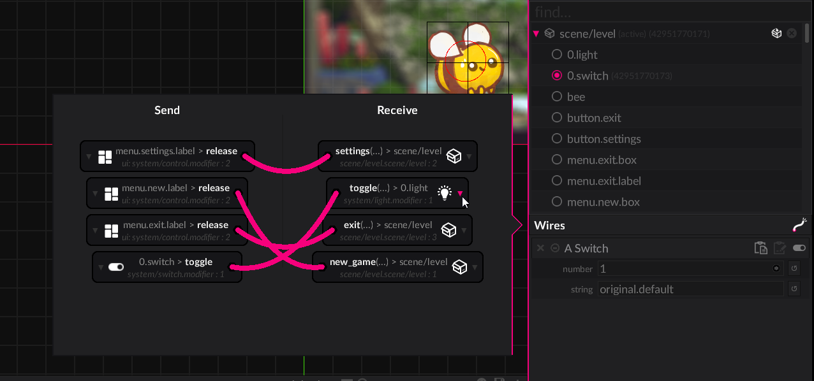
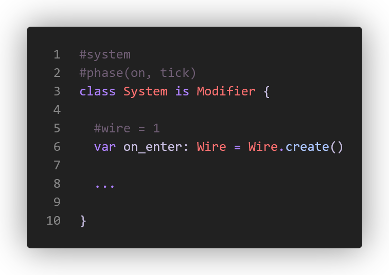
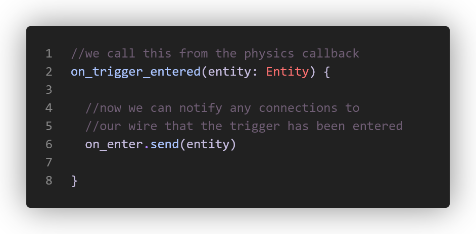
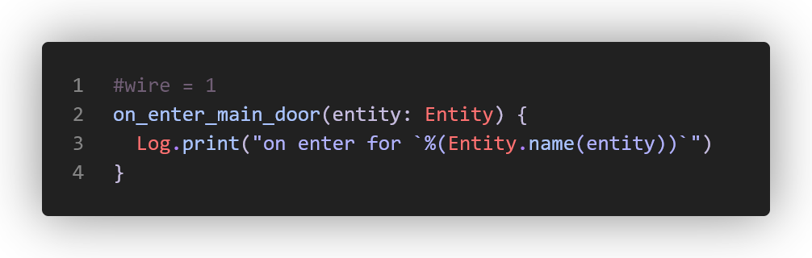
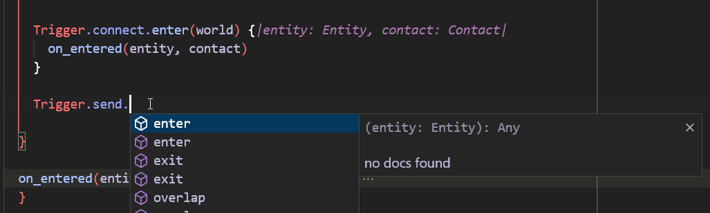

import { Badge } from '@astrojs/starlight/components';

<Badge text="Complexity: low" variant="success" />
<Badge text="Tools" variant="tip" />
<br/><br/>

:::tip[Outcome / Goals]{icon="puzzle"}
In this tutorial we'll:
- Learn about wires as a concept
- Connect to them in code and the editor
- Create our own wires in a custom modifier
:::

**This tool in luxe is a work in progress, don't worry about rough edges.**

## Wires are a way to connect things

Not every user is going to be writing system code, that's why modules exist, to share systems like Arcade so that more people have the option to make a game with less experience.

A big goal of luxe is to be approachable and accessible to a wider range of users, and one of the tools to do that comes in the form of what we call Wires. 



:::note
Wires are our version of events used to decouple code. Sometimes called signal/slots (QT, other UI libraries), they've been around for ages and you might already be familiar.
:::

Here we can see how they look in motion in the luxe editor (wip, as mentioned).

<video preload="auto" autoplay controls="" loop="loop" style="max-width:100%; width:auto; margin:auto; display:block;">  
  <source src="/video/world/wires/wires.motion.mp4" type="video/mp4"></source>
</video>

There are many ways to use this tool, but let's take a look at two obvious examples of things you can do with or without using code:

- Switch -> Light: Connect a switch to the lights that it will control
- Trigger -> Door: Connect a trigger near to a door, it will open on enter

## Outgoing wires

Any modifier (or scene script) can expose a wire to send from (left hand side) or connect to (right hand side). 
We'll take a look at a Trigger example. How do we define a wire to send across? 

We define a variable and tag it with #wire and give it an id. 



:::tip[Wire IDs]{icon="puzzle"}
The id is local to the modifier/scene script, and is designed this way to allow renaming functions and variables without worrying about it breaking links.
:::

With that, we now have an outgoing wire. 
How do we send a message on the wire? Imagine we've connected to physics, here is how we trigger it:



## Incoming connection

How do we make a function visible to send a message to, so it can show up on the right hand side for us to connect to?

We tag a function with `#wire` and an ID. That's it! 



There's more to the system, like connecting via code. 
These show up in code completion and such. 
Here's a real code example below, and you'll notice we can also send full typed blocks across the wires - the contact argument shown. 



## From code

In our game we have a `volume` modifier that responds to things entering it. 
We also have a Trigger modifier that does the work of speaking to the physics engine, and then sending a wire for us to use for convenience.

A modifier exposes it's wires via `connect` and `send` on the modifier API class!

```wren
Trigger.connect.enter(world) {|entity: Entity, contact: Contact|
  on_entered(entity, contact)
}

//manually send an exit event to any listeners
Trigger.send.exit(entity)
```

## Typed data over the wire

We can see that there's an optional data value for send and receive. This uses luxe 'blocks', which allows us to define data blocks using a Wren class definition.
We've used blocks already for our modifier `Data` class, but we can also make our own blocks for use with wires and more.

Here's an example from an inventory system that sends change notifications:

### The data definition

```wren 
// type/events/inventory.block.wren
#block = data
class InventoryChange {
  var kind: Kind = InventoryChangeKind.unknown
  #tag = "type/item.asset"
  var id: Asset = null
}

#option
class InventoryChangeKind {
  static unknown { "unknown" }
  static add { "add" }
  static remove { "remove" }
}
```

### The outgoing wire

We specify a `#type` attribute using the path of the data definition for our wire:

```wren
#wire = 1
#type = "type/events/inventory.block"
var change: Wire = Wire.create()
```

### Sending the event 

We use `change.send(entity)` to send an event without data, like we saw before.
This time we use `change.send(entity, data)` but how do we get that data?
An outgoing wire has a tool for this called `prepare`!

The prepare function returns a typed object ready to populate that we can send along:
<small>(Note that we type it explicitly for now for completion)</small>

```wren
var event: InventoryChange = change.prepare()
    event.id = the_asset
    event.kind = InventoryChangeKind.add
change.send(entity, event)
```

### Receiving the event 

And then we can listen for the event:

```wren
import "type/events/inventory.block" for InventoryChange, InventoryChangeKind

Inventory.connect.change(world) {|entity: Entity, change: InventoryChange|
  var item = Asset.get.item(change.id)
  if(item && change.kind == InventoryChangeKind.add) {
    //...
  }
}
```
